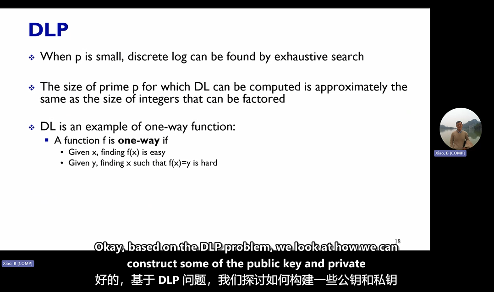

# POLYU-COMP5521-Bilingual-subtitles

POLYU COMP5521 Bilingual subtitles

这是一个 COMP5521 课程的双语字幕文件项目。你可以通过以下方式使用：

1. 将字幕文件拖动到播放器中。
2. 或者将字幕文件更改为与视频文件相同的名称，并确保它们位于同一个文件夹中，然后打开视频。

## 文件命名规则

- 英文字幕文件：`5521-20240909_195012-Meeting Recording-1009012744.srt`
- 双语字幕文件：`5521-20240909_195012-Meeting Recording-1009012744.zh-CN-dual-double.srt`

双语字幕文件以 `.zh-CN-dual-double.srt` 作为后缀，用于提供中英文双语对照。

## 技术细节

- 字幕识别使用 [Whisper](https://github.com/openai/whisper) 完成。
- 翻译使用 [智谱AI](https://ai.zhiyuanjituan.com/) 进行。
- 如果发现翻译有问题，欢迎指出并帮助改进。

## 示例

